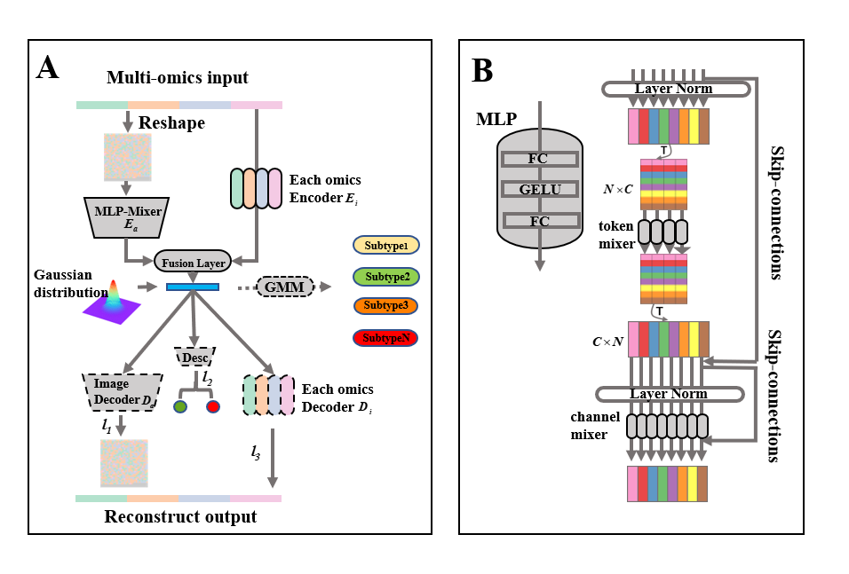

# Subtype-WGME: Subtyping with the Whole Genome multi-omics Encoder

Subtype-WGME uses genome-wide gene expression, miRNA, copy number and mutation data from PCAWG as input. It is an auto-encoder (VAE) framework using MLP-Mixer as the backbone encoder.It will capture the global association and local differences of the samples and enable superior performance of the downstream task on high-dimensional heterogeneous omics data. The obtained low-dimensional representation is used as the feature representation of the sample multi-omics data and clustered using a Gaussian mixture model.


## train
In order to use Subtype-WGME, you need to prepare the data first and put them in the right place. then you can train the encoder model with below command. We strongly recommend that you use the GPU to accelerate your training.
```shell
python train.py -t {cancer_type} -n {n_cluster}
```
## evaluate
When you are done with feature extraction, you can use the following commands for cancer subtyping
```shell
python evaluate -t {cancer_type} -exam get_p
```


